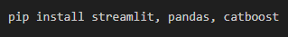
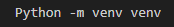
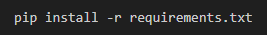

# Embed Corporation Favorita Timeseries Model To Streamlit 📲

Welcome to the **Sales Prediction App Project** for embedding a timeseries model to streamlit. The mission is to develop an app for predicting store sales using a previously trained Machine Learning model.

ebe

## Prerequisites 📈

Ensure that you install the following libraries in your Python environment or virtual environment:

* Streamlit
* Pandas
* CatBoost

The libraries can be installed using the following command:

## Setup ⚙️

To set up and run the Streamlit app in your local environment, follow these instructions:

1. Clone this repository to your local machine using the following command. Replace [<repository-url>] with the actual url to this repository:

2. Create and activate a virtual environment:

3. Install requirements.txt:

4. Run the app using the following command:

The app will be launched in your default web browser and can then be used to make sales predictions based on the input fields.

**Click on the link below to access the app :**

 [App Link](http://192.168.0.107:8501)

## Preview 🔍

## Author 👨‍💼

| Name                | LinkedIn                                                                                                                                                                                                                                   | Medium Article |
| ------------------------ | ------------------------------------------------------------------------------------------------------------------------------------------------------------------------------------------------------------------------------------------ | ----------- |
| Chidiebere David Ogbonna | [Chidiebere David Ogbonna](https://www.linkedin.com/in/chidieberedavidogbonna/) |[EMBEDDING TIMESERIES FORECASTING ANALYSIS MODEL TO STREAMLIT](https://eberedavid.medium.com/embedding-timeseries-forecasting-analysis-for-corporation-favorita-model-to-streamlit-eefe13bf8bf2)|
|                          |                                                                                                                                                                                                                                            |        |

## Features

**Sales Prediction**: The app allows users to input the product family, indicate if a product is on promotion, input the transactions, oil price, and sales. It can then predict using the CatBoost model from the Machine Learning components.

**Interactive Interface**: Streamlit provides an interactive, easy-to-use, web-based interface.

## Model Training and Saving 🤖

The CatBoost model was trained using the timeseries dataset of corporation favorita as shown in this GitHub repository: [Time-Series-Forecasting-Analysis-For-Corporation-Favorita](https://github.com/iameberedavid/Time-Series-Forecasting-Analysis-For-Corporation-Favorita). Here is a Medium article explaining the process: [TIME SERIES FORECASTING ANALYSIS FOR CORPORATION FAVORITA](https://eberedavid.medium.com/time-series-forecasting-analysis-for-corporation-favorita-4e43df145e50).

## Usage Instructions 🧑‍🏫

Input Fields: The app displays input fields for the family, onpromotion, transactions, oil_price and sales.
Prediction: Click the "Predict Sales" button to get a sales prediction based on the provided inputs.
Results: The app will display the predicted sales for the specified data in the input field.

## Acknowledgments 🙏

I would like to express my gratitude to the [Azubi Africa Data Analyst Program](https://www.azubiafrica.org/data-analytics) for their support and for offering valuable projects as part of this program. Not forgeting my scrum masters on this project [Rachel Appiah-Kubi](https://www.linkedin.com/in/racheal-appiah-kubi/) & [Emmanuel Koupoh](https://github.com/eaedk)

## License 📜

This project is licensed under the MIT License - see the [LICENSE.md](LICENSE.md) file for details.

## Contact 📧

For questions, feedback, and collaborations, please contact [Chidiebere David Ogbonna](eberedavid326@gmail.com).